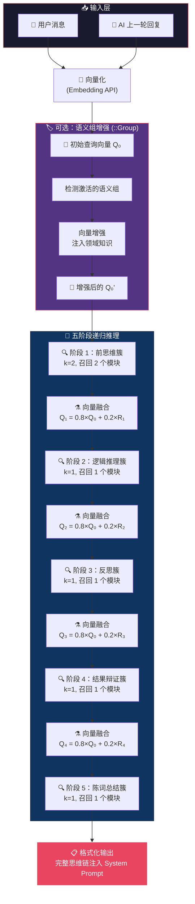
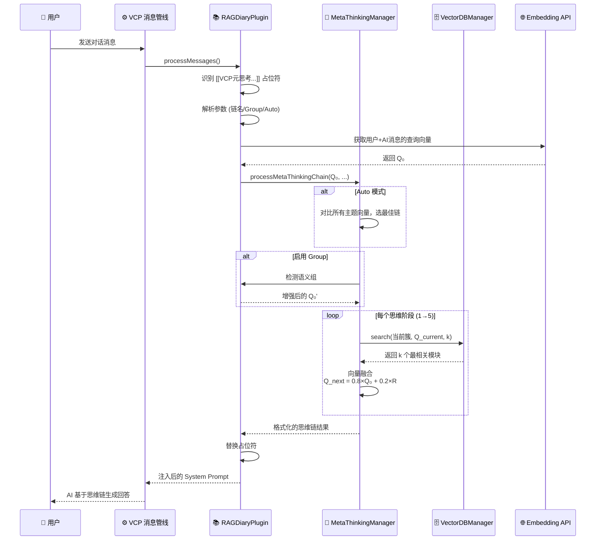

# VCP 元思考 —— 递归推理链全景解析

## 🧠 一句话理解

> **元思考 = 让 AI 像人类一样"逐步深入思考"，而不是一次性检索答案。**

传统 RAG 只做一件事：**问 → 搜 → 答**。
VCP 元思考做的是：**问 → 联想 → 推理 → 反思 → 辩证 → 总结**，且每一步的"所思所想"都会影响下一步搜索什么。

---

## 🎨 形象比喻：侦探办案

把元思考想象成一位侦探破案的完整过程：

| 阶段 | 侦探行为 | 对应的思维簇 | 做什么 |
|:---:|:---|:---:|:---|
| 1️⃣ | 拿到案件后，先**广泛收集线索** | `前思维簇` | 从知识库召回 2 条最相关的"思考模板" |
| 2️⃣ | 根据线索**逻辑推演** | `逻辑推理簇` | 基于第 1 步的发现，搜索推理模式 |
| 3️⃣ | 停下来**自我审视**——我的推理有漏洞吗？ | `反思簇` | 用融合后的新视角搜索反思模块 |
| 4️⃣ | 对结论进行**正反辩证** | `结果辩证簇` | 挑战已有结论，避免偏见 |
| 5️⃣ | 最后**整理陈述**，形成完整报告 | `陈词总结梳理簇` | 结构化总结整条思维链 |

**关键**：侦探每查看一条新线索（阶段结果），都会**更新自己对案情的认知**（向量融合），然后带着新认知去搜索下一条线索。这就是"递归"的含义 —— 思考结果反馈到下一轮搜索。

---

## 🔬 核心机制：递归向量融合

这是元思考最精妙之处。下面的流程图展示了向量如何在各阶段之间"递进演化"：



### 向量融合公式

```
Q_next = 0.8 × Q_original + 0.2 × R_current
```

- **80% 原始查询权重**：始终"锚定"在用户的原始问题上，确保不偏离主题
- **20% 当前结果权重**：让每一阶段的发现能温和地影响下一阶段的搜索方向

> [!TIP]
> 对比文档中提到的 40%:60% 比例，源码实际使用的是 **80%:20%**。这是一个更保守的选择——更强调不偏题，同时仍允许递进深入。

### 多结果向量处理

当一个阶段返回多个结果时（k > 1）：
1. 获取每个结果的 Embedding 向量
2. **取平均值**作为该阶段的代表向量
3. 再用平均向量与原始查询向量融合

---

## 📂 数据怎么组织？

元思考的"知识"存储在 `dailynote/` 目录下，每个簇文件夹里是若干 [.txt](file:///c:/Users/Lenovo/Desktop/Project%20N/VCPToolBox/Plugin/RAGDiaryPlugin/AIMemoPrompt.txt) 文件，每个文件是一个独立的"元逻辑模块"：

```
dailynote/
├── 前思维簇/           ← 阶段 1 的知识库
│   ├── 发散联想模板.txt
│   ├── 问题分解框架.txt
│   └── 背景知识检索.txt
├── 逻辑推理簇/         ← 阶段 2 的知识库
│   ├── 因果推理模式.txt
│   └── 类比推理模式.txt
├── 反思簇/             ← 阶段 3 的知识库
│   └── 认知偏误检查.txt
├── 结果辩证簇/         ← 阶段 4 的知识库
│   └── 正反论证框架.txt
└── 陈词总结梳理簇/     ← 阶段 5 的知识库
    └── 结构化输出模板.txt
```

每个 [.txt](file:///c:/Users/Lenovo/Desktop/Project%20N/VCPToolBox/Plugin/RAGDiaryPlugin/AIMemoPrompt.txt) 文件会被 VectorDBManager 索引为向量，在对应阶段被检索召回。

---

## 🛠️ 怎么用？

### 基本语法

在 **System Prompt** 中加入占位符：

```
[[VCP元思考::Group]]
```

系统在处理消息时会自动：
1. 识别这个占位符
2. 调用 `MetaThinkingManager.processMetaThinkingChain()`
3. 执行五阶段递归推理
4. 将结果**替换**占位符，注入到 System Prompt 中

### 完整语法

```
[[VCP元思考:<链名称>::<修饰符>]]
```

| 参数 | 说明 | 示例 |
|:---|:---|:---|
| 链名称 | 使用哪条思维链，默认 `default` | `creative_writing` |
| [::Group](file:///c:/Users/Lenovo/Desktop/Project%20N/VCPToolBox/Plugin/RAGDiaryPlugin/RAGDiaryPlugin.js#2338-2362) | 启用语义组增强 | 增强领域理解 |
| `::Auto` | 自动选择最匹配的思维链 | 基于向量相似度 |
| `::Auto:0.7` | 自动模式 + 自定义阈值 | 阈值越高越严格 |

### 实用示例

````carousel
**☝️ 最常用：默认链 + 语义组增强**
```
[[VCP元思考::Group]]
```
五阶段递归推理，语义组帮助理解专业术语

<!-- slide -->

**✌️ 自动选择最佳思维链**
```
[[VCP元思考::Auto::Group]]
```
系统自动匹配最合适的思维链主题

<!-- slide -->

**🤟 指定自定义思维链**
```
[[VCP元思考:creative_writing::Group]]
```
使用在 `meta_thinking_chains.json` 中定义的自定义链

<!-- slide -->

**✋ 纯向量推理（不用语义组）**
```
[[VCP元思考]]
```
最朴素的模式，仅依赖向量相似度
````

### 自定义思维链

编辑 [meta_thinking_chains.json](file:///c:/Users/Lenovo/Desktop/Project%20N/VCPToolBox/Plugin/RAGDiaryPlugin/meta_thinking_chains.json) 添加新链：

```json
{
  "chains": {
    "default": {
      "clusters": ["前思维簇", "逻辑推理簇", "反思簇", "结果辩证簇", "陈词总结梳理簇"],
      "kSequence": [2, 1, 1, 1, 1]
    },
    "creative_writing": {
      "clusters": ["灵感火花簇", "情节构建簇", "角色深化簇", "世界观设定簇"],
      "kSequence": [2, 2, 1, 1]
    }
  }
}
```

然后在 `dailynote/` 下创建对应的文件夹和 [.txt](file:///c:/Users/Lenovo/Desktop/Project%20N/VCPToolBox/Plugin/RAGDiaryPlugin/AIMemoPrompt.txt) 文件即可。

---

## 🔄 完整执行流程

下面展示了从用户发送消息到元思考结果注入的完整链路：



---

## 📊 输出示例

元思考执行完毕后，以下内容会被注入到 System Prompt 中（替换原占位符）：

```
[--- VCP元思考链: "default" ---]
[推理链路径: 前思维簇 → 逻辑推理簇 → 反思簇 → 结果辩证簇 → 陈词总结梳理簇]

【阶段1: 前思维簇】
  [召回 2 个元逻辑模块]
  * 当面对复杂问题时，先分解为子问题...
  * 联想相关领域的已有知识框架...

【阶段2: 逻辑推理簇】
  [召回 1 个元逻辑模块]
  * 运用因果推理链：如果A则B，如果B则C...

【阶段3: 反思簇】
  [召回 1 个元逻辑模块]
  * 检查推理中是否存在确认偏误...

【阶段4: 结果辩证簇】
  [召回 1 个元逻辑模块]
  * 从反面审视结论：如果假设不成立...

【阶段5: 陈词总结梳理簇】
  [召回 1 个元逻辑模块]
  * 按照"问题-分析-结论-建议"结构组织输出...

[--- 元思考链结束 ---]
```

AI 模型收到这些内容后，会参考这些"思考模板"来组织自己的回答，从而产生更有深度、更结构化的输出。

---

## ⚡ 关键设计亮点

| 特性 | 说明 |
|:---|:---|
| **递归而非一次检索** | 每阶段结果影响下一阶段搜索，形成真正的思维递进 |
| **可缓存** | 相同查询直接返回缓存结果，避免重复计算 |
| **Auto 模式** | 自动匹配最合适的思维链，无需手动指定 |
| **语义组增强** | 识别专业领域术语，增强向量精度 |
| **降级容错** | 某阶段无结果时标记降级，不中断整条链 |
| **可自定义** | 通过 JSON 配置定义任意思维链和 K 序列 |
| **VCP 可观测** | 执行详情广播到 RAG Observer，可实时调试 |
